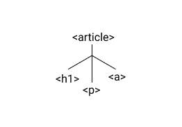
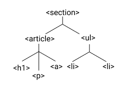

# HTML Tree

```html
<article>
  <h1>Learning HTML</h1>
  <p>Get to know the HTML basics.</p>
  <a href="http://html5rocks.com">Read Article</a>
</article>
```



```html
<section>
  <article>
    <h1>Learning HTML</h1>
    <p>Get to know the HTML basics.</p>
    <a href="http://html5rocks.com">Read Article</a>
  </article>
  <ul>
    <li>HTML Syntax</li>
    <li>CSS Syntax</li>
  </ul>
</section>
```

